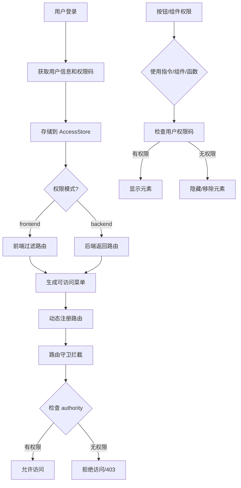

# 权限管理模块 (Access Control)

## 📋 概述

本模块提供了完整的权限管理解决方案，支持**前端权限控制**和**后端权限控制**两种模式，实现了细粒度的访问控制。

### 核心特性

- ✅ **双模式支持**：前端路由权限 / 后端动态路由
- ✅ **多维度权限**：角色权限 + 权限码权限
- ✅ **多层级控制**：路由级别 + 菜单级别 + 按钮级别 + 组件级别
- ✅ **灵活配置**：指令、组件、函数三种使用方式
- ✅ **超级管理员**：特殊角色拥有所有权限

---

## 🏗️ 架构设计

### 权限模式

```typescript
type AccessModeType = "frontend" | "backend";
```

#### 1. 前端权限模式 (`frontend`)
- 所有路由在前端定义
- 根据用户角色/权限码过滤可访问的路由
- 适合中小型项目，权限规则相对固定

#### 2. 后端权限模式 (`backend`)
- 路由由后端动态返回
- 前端根据后端返回的路由数据动态生成菜单和路由
- 适合大型项目，权限规则灵活多变

### 权限判断维度

| 维度 | 说明 | 示例 |
|------|------|------|
| **角色权限** | 基于用户角色判断 | `ADMIN`, `MANAGER`, `USER` |
| **权限码权限** | 基于权限标识判断 | `sys:user:create`, `sys:user:update` |

---

## 📁 模块结构

```
src/core/access/
├── README.md                  # 本文档
├── index.ts                   # 模块导出入口
├── use-access.ts              # 权限判断 Hook
├── access-control.vue         # 权限控制组件
├── directive.ts               # 权限指令
└── accessible.ts              # 路由和菜单生成
```

---

## 🚀 使用方法

### 1️⃣ 路由级别权限控制

在路由元信息中配置 `authority` 字段：

```typescript
// src/router/routes/modules/app/permission.ts
{
  path: "/permission",
  name: "PermissionManagement",
  component: Layout,
  meta: {
    title: "routes:permission.moduleName",
    authority: ["sys:platform_admin", "sys:tenant_manager"], // 需要这些权限之一
  },
  children: [
    {
      path: "codes",
      name: "PermissionPointManagement",
      meta: {
        title: "routes:permission.permission",
        authority: ["sys:platform_admin"], // 仅平台管理员可访问
      },
      component: () => import("@/views/app/permission/permission/index.vue"),
    },
  ],
}
```

**工作原理：**
- 系统会在路由守卫中检查当前用户的权限
- 如果用户不拥有 `authority` 中指定的任一权限，该路由将不会被添加到可访问路由列表中
- 对应的菜单项也不会显示

---

### 按钮级别权限控制

#### 方式一：使用指令（推荐）

```vue
<template>
  <!-- 单个权限码 -->
  <el-button v-access:code="'sys:user:create'">新增</el-button>
  
  <!-- 多个权限码（满足一个即可） -->
  <el-button v-access:code="['sys:user:create', 'sys:user:update']">操作</el-button>
  
  <!-- 角色权限 -->
  <div v-access:role="'ADMIN'">管理员可见</div>
</template>
```

**指令说明：**
- `v-access:code` - 基于权限码判断
- `v-access:role` - 基于角色判断
- 支持字符串和数组形式
- 无权限时自动移除 DOM 元素

#### 方式二：使用 Hook（推荐）

```vue
<script setup lang="ts">
import { useAccess } from '@/core/access';

const { hasAccessByCodes, hasAccessByRoles } = useAccess();

// 在 script 中使用
const canCreate = hasAccessByCodes(['sys:user:create']);
const canEdit = hasAccessByCodes(['sys:user:create', 'sys:user:update']);
const isAdmin = hasAccessByRoles(['ADMIN']);
</script>

<template>
  <el-button v-if="canCreate">新增</el-button>
  <el-button v-if="canEdit">编辑</el-button>
  <div v-if="isAdmin">管理员内容</div>
</template>
```

#### 方式三：使用权限控制组件

```vue
<template>
  <!-- 基于权限码 -->
  <AccessControl :codes="['sys:user:create']" type="code">
    <el-button>新增</el-button>
  </AccessControl>
  
  <!-- 基于角色 -->
  <AccessControl :codes="['ADMIN']" type="role">
    <el-button>管理员操作</el-button>
  </AccessControl>
</template>

<script setup lang="ts">
import { AccessControl } from '@/core/access';
</script>
```

---

### 组件内部权限判断

```vue
<script setup lang="ts">
import { useAccess } from '@/core/access';

const { hasAccessByCodes, hasAccessByRoles, accessMode } = useAccess();

// 检查是否有任意一个权限码
const canOperate = hasAccessByCodes(['sys:user:create', 'sys:user:update']);

// 检查是否有任意一个角色
const isAdmin = hasAccessByRoles(['ADMIN', 'SUPER_ADMIN']);

// 获取当前权限模式
console.log('当前权限模式:', accessMode.value); // 'frontend' | 'backend'
</script>
```

---

## 🔧 API 参考

### Hooks

#### `useAccess()`

权限判断的核心 Hook，提供以下方法：

```typescript
interface UseAccessReturn {
  /** 当前权限模式 */
  accessMode: Ref<"frontend" | "backend">;
  
  /** 基于权限码判断是否有权限（满足一个即可） */
  hasAccessByCodes: (codes: string[]) => boolean;
  
  /** 基于角色判断是否有权限（满足一个即可） */
  hasAccessByRoles: (roles: string[]) => boolean;
  
  /** 切换权限模式 */
  toggleAccessMode: () => Promise<void>;
}
```

**使用示例：**

```typescript
import { useAccess } from '@/core/access';

const { hasAccessByCodes, hasAccessByRoles } = useAccess();

if (hasAccessByCodes(['sys:user:create'])) {
  console.log('有创建用户的权限');
}

if (hasAccessByRoles(['ADMIN'])) {
  console.log('是管理员角色');
}
```

---

### 工具函数（兼容层）

位于 `src/utils/auth.tsx`，内部调用 `core/access`，标记为 `@deprecated`：

```typescript
/**
 * @deprecated 建议直接使用 useAccess() Hook
 */
export function hasPerm(value: string | string[], type: "button" | "role" = "button"): boolean;

/**
 * @deprecated 建议直接使用 useAccess().hasAccessByCodes()
 */
export function hasAnyPerm(perms: string[]): boolean;

export function hasAllPerms(perms: string[]): boolean;
export function hasAnyRole(roles: string[]): boolean;
export function hasAllRoles(roles: string[]): boolean;
```

**迁移示例：**

```typescript
// ❌ 旧用法（已废弃）
import { hasPerm, hasAnyPerm } from '@/utils/auth';
hasPerm('sys:user:create');
hasAnyPerm(['sys:user:create', 'sys:user:update']);

// ✅ 新用法（推荐）
import { useAccess } from '@/core/access';
const { hasAccessByCodes } = useAccess();
hasAccessByCodes(['sys:user:create']);
hasAccessByCodes(['sys:user:create', 'sys:user:update']);
```

---

### 指令

#### `v-access:code` - 权限码指令

```vue
<!-- 字符串形式 -->
<el-button v-access:code="'sys:user:create'">新增</el-button>

<!-- 数组形式 -->
<el-button v-access:code="['sys:user:create', 'sys:user:update']">操作</el-button>
```

#### `v-access:role` - 角色权限指令

```vue
<!-- 字符串形式 -->
<div v-access:role="'ADMIN'">管理员内容</div>

<!-- 数组形式 -->
<div v-access:role="['ADMIN', 'MANAGER']">管理内容</div>
```

**特性：**
- 自动适配权限模式（frontend/backend）
- 无权限时从 DOM 中移除元素
- 支持响应式更新

---

### 组件

#### `<AccessControl>`

权限控制包装组件，无权限时不渲染子元素。

**Props：**

| 属性 | 类型 | 默认值 | 说明 |
|------|------|--------|------|
| `codes` | `string[]` | `[]` | 权限码或角色列表 |
| `type` | `"code" \| "role"` | `"role"` | 权限类型 |

**使用示例：**

```vue
<template>
  <!-- 基于权限码 -->
  <AccessControl :codes="['sys:user:create']" type="code">
    <el-button>新增用户</el-button>
  </AccessControl>
  
  <!-- 基于角色 -->
  <AccessControl :codes="['ADMIN']" type="role">
    <el-alert type="warning">管理员专属功能</el-alert>
  </AccessControl>
</template>
```

---

## 🎯 权限流程

### 完整权限检查流程



### 权限数据存储

```typescript
// AccessStore 存储结构
interface AccessState {
  /** 权限码列表（角色 + 权限点） */
  accessCodes: string[];
  
  /** 可访问的菜单列表 */
  accessMenus: MenuRecordRaw[];
  
  /** 可访问的路由列表 */
  accessRoutes: RouteRecordRaw[];
  
  /** 登录 accessToken */
  accessToken: string | null;
  
  /** 是否已检查权限 */
  isAccessChecked: boolean;
}
```

---

## ⚙️ 配置说明

### 切换权限模式

```typescript
import { preferences, updatePreferences } from '@/core/preferences';

// 切换到前端权限模式
updatePreferences({
  app: {
    accessMode: 'frontend',
  },
});

// 切换到后端权限模式
updatePreferences({
  app: {
    accessMode: 'backend',
  },
});

// 或使用 Hook
import { useAccess } from '@/core/access';
const { toggleAccessMode } = useAccess();
await toggleAccessMode();
```

### 超级管理员配置

```typescript
// src/constants/index.ts
export const ROLE_ROOT = "*:*:*";

// 拥有此角色的用户自动拥有所有权限
if (roles.includes(ROLE_ROOT)) {
  return true; // 跳过所有权限检查
}
```

---

## 💡 最佳实践

### 1. 路由权限配置

```typescript
// ✅ 推荐：明确指定需要的权限
{
  path: "/user",
  meta: {
    authority: ["sys:user:view"],
  },
}

// ❌ 不推荐：权限过于宽泛
{
  path: "/user",
  meta: {
    authority: ["*:*:*"], // 所有人都能访问
  },
}
```

### 2. 按钮权限配置

```vue
<!-- ✅ 推荐：使用新指令 -->
<el-button v-access:code="'sys:user:create'">新增</el-button>
<el-button v-access:code="'sys:user:update'">编辑</el-button>
<el-button v-access:code="'sys:user:delete'">删除</el-button>

<!-- ❌ 不推荐：使用旧指令（已废弃） -->
<el-button v-has-perm="'sys:user:create'">新增</el-button>

<!-- ❌ 不推荐：权限标识不清晰 -->
<el-button v-access:code="'user_add'">新增</el-button>
```

### 3. 权限前缀规范

建议使用统一的权限前缀：

```
模块:资源:操作
例如：
- sys:user:create    (系统模块-用户资源-创建操作)
- sys:user:update    (系统模块-用户资源-更新操作)
- sys:user:delete    (系统模块-用户资源-删除操作)
- sys:user:view      (系统模块-用户资源-查看操作)
- sys:user:export    (系统模块-用户资源-导出操作)
```

### 4. CURD 页面权限配置

```typescript
// PageContent 配置
const pageContentConfig = {
  permPrefix: "sys:user", // 权限前缀
  toolbar: [
    "add",      // 自动组合为 sys:user:add
    "delete",   // 自动组合为 sys:user:delete
    "export",   // 自动组合为 sys:user:export
  ],
  columns: [
    {
      action: [
        "edit",   // 自动组合为 sys:user:edit
        "delete", // 自动组合为 sys:user:delete
      ],
    },
  ],
};
```

---

## 🔍 常见问题

### Q1: 如何调试权限问题？

```typescript
// 在浏览器控制台查看当前用户权限
import { useAccessStore, useAppUserStore } from '@/stores';

const accessStore = useAccessStore();
const userStore = useAppUserStore();

console.log('用户角色:', userStore.userInfo.roles);
console.log('用户权限码:', accessStore.accessCodes);
console.log('可访问路由:', accessStore.accessRoutes);
console.log('可访问菜单:', accessStore.accessMenus);
```

### Q2: 权限变更后如何刷新？

```typescript
// 重新获取用户权限并刷新路由
import { useAuthStore } from '@/stores';

const authStore = useAuthStore();
await authStore.getUserPermissionCodes();

// 或者刷新整个页面
location.reload();
```

### Q3: 如何实现"与"逻辑（需要同时拥有多个权限）？

```vue
<script setup lang="ts">
import { useAccess } from '@/core/access';

const { hasAccessByCodes } = useAccess();

// 需要同时拥有两个权限
const canAdvancedOperation = computed(() => {
  return hasAccessByCodes(['sys:user:create']) && 
         hasAccessByCodes(['sys:user:approve']);
});
</script>

<template>
  <el-button v-if="canAdvancedOperation">高级操作</el-button>
</template>
```

### Q4: 如何在非组件环境中检查权限？

```typescript
import { useAccessStore } from '@/stores';

function checkPermission(permission: string): boolean {
  const accessStore = useAccessStore();
  return accessStore.accessCodes.includes(permission);
}
```

---

## 📝 注意事项

1. **权限缓存**：权限数据存储在 Pinia Store 中，页面刷新后会丢失，需要在路由守卫中重新获取
2. **超级管理员**：拥有 `*:*:*` 角色的用户会自动通过所有权限检查
3. **权限粒度**：建议权限标识细化到具体操作，避免过于宽泛
4. **性能优化**：权限判断使用了 Set 数据结构，查询复杂度为 O(1)
5. **安全性**：前端权限控制仅用于 UI 展示，真正的权限验证应在后端进行

---

## 🔗 相关文档

- [路由守卫](../router/guard.ts)
- [权限 Store](../../stores/modules/core/access.store.ts)
- [权限工具函数](../../utils/auth.ts)
- [CURD 组件权限配置](../../components/CURD/PageContent.vue)

---
