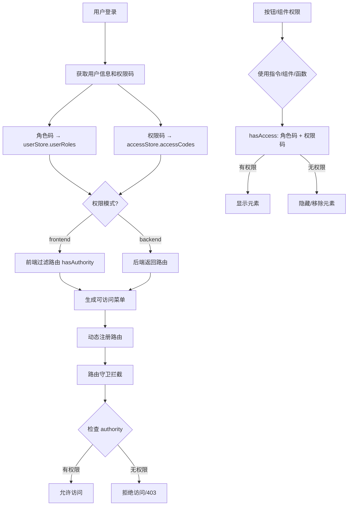

# 权限管理模块 (Access Control)

## 📋 概述

本模块提供了完整的权限管理解决方案，支持**前端权限控制**和**后端权限控制**两种模式，实现了细粒度的访问控制。

### 核心特性

- ✅ **双模式支持**：前端路由权限 / 后端动态路由
- ✅ **多维度权限**：角色权限 + 权限码权限
- ✅ **多层级控制**：路由级别 + 菜单级别 + 按钮级别 + 组件级别
- ✅ **灵活配置**：指令、组件、函数三种使用方式
- ✅ **路由豁免**：通过 `meta.ignoreAccess` 跳过权限检查

---

## 🏗️ 架构设计

### 权限模式

```typescript
type AccessModeType = "frontend" | "backend";
```

#### 1. 前端权限模式 (`frontend`)
- 所有路由在前端定义
- 根据用户角色/权限码过滤可访问的路由
- 适合中小型项目，权限规则相对固定

#### 2. 后端权限模式 (`backend`)
- 路由由后端动态返回
- 前端根据后端返回的路由数据动态生成菜单和路由
- 适合大型项目，权限规则灵活多变

### 权限判断维度

| 维度 | 数据源 | 存储位置 | 匹配方式 |
|------|--------|---------|----------|
| **角色码** | `getMe().roles` | `userStore.userRoles` | 精确匹配 |
| **权限码** | `GetMyPermissionCode()` | `accessStore.accessCodes` | 前缀匹配 |

---

## 📁 模块结构

```
src/core/access/
├── README.md                  # 本文档
├── index.ts                   # 模块导出入口
├── use-access.ts              # 权限判断 Hook
├── access-control.vue         # 权限控制组件
└── directive.ts               # 权限指令
```

---

## 🚀 使用方法

### 1️⃣ 路由级别权限控制

在路由元信息中配置 `authority` 字段：

```typescript
// src/router/routes/modules/app/permission.ts
{
  path: "/permission",
  name: "PermissionManagement",
  component: Layout,
  meta: {
    title: "routes.permission.moduleName",
    authority: ["sys:platform_admin", "sys:tenant_manager"], // 需要这些权限之一
  },
  children: [
    {
      path: "codes",
      name: "PermissionPointManagement",
      meta: {
        title: "routes.permission.permission",
        authority: ["sys:platform_admin"], // 仅平台管理员可访问
      },
      component: () => import("@/views/app/permission/permission/index.vue"),
    },
  ],
}
```

**工作原理：**
- 系统会在路由守卫中检查当前用户的权限
- 如果用户不拥有 `authority` 中指定的任一权限，该路由将不会被添加到可访问路由列表中
- 对应的菜单项也不会显示

---

### 按钮级别权限控制

#### 方式一：使用权限控制组件（推荐）

`AccessControl` 是声明式的权限包裹组件，Pro 组件（ProToolbar、ProTableCellContent）内部已使用它实现按钮级鉴权，业务页面也可直接使用：

```vue
<template>
  <!-- 传入 codes 检查权限，不传或 undefined 表示不限制 -->
  <AccessControl :codes="['sys:user:create']">
    <el-button>新增</el-button>
  </AccessControl>

  <!-- 多个权限码（满足一个即可） -->
  <AccessControl :codes="['sys:user:create', 'sys:user:update']">
    <el-button>操作</el-button>
  </AccessControl>
</template>

<script setup lang="ts">
import { AccessControl } from '@/core/access';
</script>
```

**组件说明：**
- 同时检查角色码（精确匹配）和权限码（前缀匹配），取并集
- 无权限时不渲染子元素
- `codes` 不传或 `undefined` 表示不限制（始终渲染）

#### 方式二：使用指令

```vue
<template>
  <!-- 单个权限码（同时检查角色码和权限码） -->
  <el-button v-access="'sys:user:create'">新增</el-button>

  <!-- 多个权限码（满足一个即可） -->
  <el-button v-access="['sys:user:create', 'sys:user:update']">操作</el-button>
</template>
```

**指令说明：**
- `v-access` - 同时检查角色码（精确匹配）和权限码（前缀匹配），取并集
- 支持字符串和数组形式
- 无权限时自动移除 DOM 元素

#### 方式三：使用 Hook

```vue
<script setup lang="ts">
import { useAccess } from '@/core/access';

const { hasAccess, hasAccessByCodes, hasAccessByRoles } = useAccess();

// 综合检查（角色码 + 权限码，取并集，推荐）
const canCreate = hasAccess(['sys:user:create']);

// 单独检查权限码（前缀匹配）
const canEdit = hasAccessByCodes(['sys:user:update']);

// 单独检查角色码（精确匹配）
const isAdmin = hasAccessByRoles(['sys:platform_admin']);
</script>

<template>
  <el-button v-if="canCreate">新增</el-button>
  <el-button v-if="canEdit">编辑</el-button>
  <div v-if="isAdmin">管理员内容</div>
</template>
```

---

### 组件内部权限判断

```vue
<script setup lang="ts">
import { useAccess } from '@/core/access';

const { hasAccess, hasAccessByCodes, hasAccessByRoles, accessMode } = useAccess();

// 综合检查（角色码 + 权限码，取并集，推荐用于混合标识场景）
const canOperate = hasAccess(['sys:user:create', 'sys:user:update']);

// 单独检查权限码（前缀匹配）
const canEdit = hasAccessByCodes(['sys:user:update']);

// 单独检查角色码（精确匹配）
const isAdmin = hasAccessByRoles(['sys:platform_admin']);

// 获取当前权限模式
console.log('当前权限模式:', accessMode.value); // 'frontend' | 'backend'
</script>
```

---

## 🔧 API 参考

### Hooks

#### `useAccess()`

权限判断的核心 Hook，提供以下方法：

```typescript
interface UseAccessReturn {
  /** 当前权限模式 */
  accessMode: Ref<"frontend" | "backend">;
  
  /** 综合权限检查（角色码 + 权限码，取并集，推荐用于混合标识场景） */
  hasAccess: (authority: string[]) => boolean;
  
  /** 基于权限码判断（前缀匹配） */
  hasAccessByCodes: (codes: string[]) => boolean;
  
  /** 基于角色码判断（精确匹配） */
  hasAccessByRoles: (roles: string[]) => boolean;
  
  /** 切换权限模式 */
  toggleAccessMode: () => Promise<void>;
}
```

**使用示例：**

```typescript
import { useAccess } from '@/core/access';

const { hasAccess, hasAccessByCodes, hasAccessByRoles } = useAccess();

if (hasAccess(['sys:user:create'])) {
  console.log('有创建用户的权限（角色码或权限码匹配）');
}

if (hasAccessByCodes(['sys:user:create'])) {
  console.log('有创建用户的权限码');
}

if (hasAccessByRoles(['sys:platform_admin'])) {
  console.log('是平台管理员角色');
}
```

---

### 指令

#### `v-access` - 权限指令

```vue
<!-- 字符串形式 -->
<el-button v-access="'sys:user:create'">新增</el-button>

<!-- 数组形式 -->
<el-button v-access="['sys:user:create', 'sys:user:update']">操作</el-button>
```

**特性：**
- 同时检查角色码和权限码（取并集）
- 无权限时从 DOM 中移除元素
- 支持响应式更新

---

### 组件

#### `<AccessControl>`

权限控制包装组件，无权限时不渲染子元素。

**Props：**

| 属性 | 类型 | 默认值 | 说明 |
|------|------|--------|------|
| `codes` | `string[]?` | `undefined` | 权限标识列表（角色码或权限码均可），不传表示不限制 |

**使用示例：**

```vue
<template>
  <!-- 检查权限码 -->
  <AccessControl :codes="['sys:user:create']">
    <el-button>新增用户</el-button>
  </AccessControl>

  <!-- 检查角色码 -->
  <AccessControl :codes="['sys:platform_admin']">
    <el-alert type="warning">管理员专属功能</el-alert>
  </AccessControl>

  <!-- 不限制（始终渲染） -->
  <AccessControl>
    <el-button>公共按钮</el-button>
  </AccessControl>
</template>
```

---

## 🎯 权限流程

### 完整权限检查流程



### 权限数据存储

```typescript
// 双池存储结构

// 1. accessStore（权限码，来自 GetMyPermissionCode）
interface AccessState {
  /** 权限码列表（仅权限码，不含角色码） */
  accessCodes: string[];
  
  /** 可访问的菜单列表 */
  accessMenus: MenuRecordRaw[];
  
  /** 可访问的路由列表 */
  accessRoutes: RouteRecordRaw[];
  
  /** 登录 accessToken */
  accessToken: string | null;
  
  /** 是否已检查权限 */
  isAccessChecked: boolean;
}

// 2. userStore（角色码，来自 getMe().roles）
interface UserState {
  /** 用户角色码（参与权限判断） */
  userRoles: string[];
  
  /** 用户信息 */
  userInfo: BasicUserInfo | null;
}
```

---

## ⚙️ 配置说明

### 切换权限模式

```typescript
import { preferences, updatePreferences } from '@/core/preferences';

// 切换到前端权限模式
updatePreferences({
  app: {
    accessMode: 'frontend',
  },
});

// 切换到后端权限模式
updatePreferences({
  app: {
    accessMode: 'backend',
  },
});

// 或使用 Hook
import { useAccess } from '@/core/access';
const { toggleAccessMode } = useAccess();
await toggleAccessMode();
```

### 路由豁免（ignoreAccess）

对于不需要权限检查的路由（如登录页、404 页），在路由 `meta` 中设置 `ignoreAccess: true`：

```typescript
{
  path: "/login",
  meta: {
    ignoreAccess: true, // 此路由不需要权限检查
  },
}
```

**说明：**
- `ignoreAccess` 是路由级别的权限豁免，表示该路由本身不参与权限过滤
- 在前端路由过滤（`hasAuthority`）中，标记 `ignoreAccess` 的路由直接放行
- 与 `authority` 互斥：设置了 `ignoreAccess` 的路由不应再设置 `authority`

---

## 💡 最佳实践

### 1. 路由权限配置

```typescript
// ✅ 推荐：明确指定需要的权限
{
  path: "/user",
  meta: {
    authority: ["sys:user:view"],
  },
}

// ✅ 推荐：不需要权限检查的路由使用 ignoreAccess
{
  path: "/login",
  meta: {
    ignoreAccess: true,
  },
}
```

### 2. 按钮权限配置

```vue
<!-- ✅ 推荐：使用 v-access 指令 -->
<el-button v-access="'sys:user:create'">新增</el-button>
<el-button v-access="'sys:user:update'">编辑</el-button>
<el-button v-access="'sys:user:delete'">删除</el-button>

<!-- ❌ 不推荐：权限标识不清晰 -->
<el-button v-access="'user_add'">新增</el-button>
```

### 3. 权限码命名规范

建议使用统一的命名格式：

```
模块:资源:操作
例如：
- sys:user:create    (系统模块-用户资源-创建操作)
- sys:user:update    (系统模块-用户资源-更新操作)
- sys:user:delete    (系统模块-用户资源-删除操作)
- sys:user:view      (系统模块-用户资源-查看操作)
- sys:user:export    (系统模块-用户资源-导出操作)
```

### 4. ProPage 按钮权限配置

Pro 组件已内置 `AccessControl` 包裹，只需在按钮配置中添加 `auth` 字段即可实现权限控制：

```typescript
const pageConfig: ProPageConfig = {
  table: {
    toolbar: [
      // 工具栏按钮：auth 传入完整权限标识，无权限时按钮不显示
      { name: "add", text: "新增", auth: "sys:user:create" },
      { name: "delete", text: "删除", auth: "sys:user:delete" },
      // 不设 auth 的按钮始终显示（不受权限控制）
      { name: "refresh", text: "刷新" },
    ],
    columns: [
      {
        cellType: "tool",
        buttons: [
          // 操作列按钮：同样通过 auth 控制权限
          { name: "edit", text: "编辑", auth: "sys:user:update" },
          { name: "delete", text: "删除", auth: "sys:user:delete" },
        ],
      },
    ],
  },
};
```

**实现原理：** `ProToolbar` 和 `ProTableCellContent` 内部使用 `AccessControl` 组件包裹按钮，根据 `auth` 字段自动进行权限检查。

---

## 🔍 常见问题

### Q1: 如何调试权限问题？

```typescript
// 在浏览器控制台查看当前用户权限
import { useAccessStore, useAppUserStore } from '@/stores';

const accessStore = useAccessStore();
const userStore = useAppUserStore();

console.log('用户角色码:', userStore.userRoles);
console.log('用户权限码:', accessStore.accessCodes);
console.log('可访问路由:', accessStore.accessRoutes);
console.log('可访问菜单:', accessStore.accessMenus);
```

### Q2: 权限变更后如何刷新？

```typescript
// 刷新整个页面即可，路由守卫会重新获取权限
location.reload();
```

### Q3: 如何实现"与"逻辑（需要同时拥有多个权限）？

```vue
<script setup lang="ts">
import { useAccess } from '@/core/access';

const { hasAccessByCodes } = useAccess();

// 需要同时拥有两个权限
const canAdvancedOperation = computed(() => {
  return hasAccessByCodes(['sys:user:create']) && 
         hasAccessByCodes(['sys:user:approve']);
});
</script>

<template>
  <el-button v-if="canAdvancedOperation">高级操作</el-button>
</template>
```

### Q4: 如何在非组件环境中检查权限？

```typescript
import { useAccessStore, useAppUserStore } from '@/stores';

function checkPermission(code: string): boolean {
  const accessStore = useAccessStore();
  return accessStore.accessCodes.includes(code);
}

function checkRole(role: string): boolean {
  const userStore = useAppUserStore();
  return userStore.userRoles.includes(role);
}
```

---

## 📝 注意事项

1. **权限缓存**：权限数据存储在 Pinia Store 中，页面刷新后会丢失，需要在路由守卫中重新获取
2. **路由豁免**：使用 `meta.ignoreAccess: true` 标记不需要权限检查的路由，而非使用特殊权限码
3. **权限粒度**：建议权限标识细化到具体操作，避免过于宽泛
4. **性能优化**：权限判断使用了 Set 数据结构，查询复杂度为 O(1)
5. **安全性**：前端权限控制仅用于 UI 展示，真正的权限验证应在后端进行

---

## 🔗 相关文档

- [路由守卫](../../router/guard.ts)
- [权限 Store](../../stores/modules/access.store.ts)
- [用户 Store](../../stores/modules/app-user.store.ts)
- [Pro 组件权限配置](../Pro/README.md)

---
